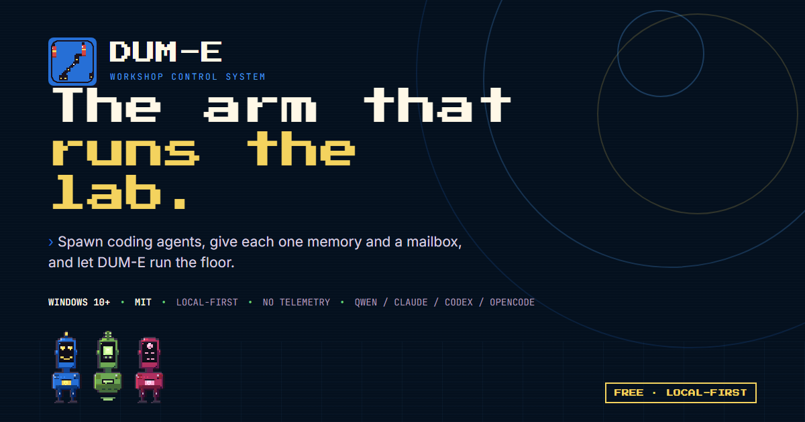

# DUM-E — The arm that runs the lab

> Spawn coding agents, give each one memory and a mailbox, and let DUM-E run the floor. Real terminals. Shared tasks. A robot floor you can watch.

<video src="https://github.com/uppalasrichaitanya/DUM-E-site/releases/download/v0.1.1/floor-loop.webm" poster="assets/motion/floor-loop-poster.webp" controls muted loop playsinline width="800"></video>

**Live site:** https://uppalasrichaitanya.github.io/DUM-E-site/ → https://dum-e-lab.com (soon)

**App source & releases:**
- App (MIT, will be public): https://github.com/uppalasrichaitanya/DUM-E
- Downloads: https://github.com/uppalasrichaitanya/DUM-E-site/releases — direct links below

### What it is — in 20 seconds

* **Real terminals** — one PTY per robot (xterm.js), not a chat wrapper. Every robot runs a live CLI session.
* **Memory + mailboxes** — one `memory.md` per agent, `inbox/outbox` routed every 1.5s, shared `tasks.json` kanban.
* **You supervise, DUM-E delegates** — the floor is the status system. Rack LEDs blink, the charger steams, robots bob and blink.

### Download v0.1.1

* **Windows Installer** — `DUM-E-0.1.1-win-x64-setup.exe` — [direct download](https://github.com/uppalasrichaitanya/DUM-E-site/releases/download/v0.1.1/DUM-E-0.1.1-win-x64-setup.exe)
* **Windows Portable** — `DUM-E-0.1.1-win-x64-portable.exe` — [direct download](https://github.com/uppalasrichaitanya/DUM-E-site/releases/download/v0.1.1/DUM-E-0.1.1-win-x64-portable.exe)
* All releases + checksums on the [Releases page](https://github.com/uppalasrichaitanya/DUM-E-site/releases)

Unsigned builds — Windows SmartScreen may ask you to trust DUM-E the first time. Free, MIT licensed, local-first, no telemetry.

### How this site is built

`web/` → `stage-site.cjs` allowlist (65 files, no videos/tools/raw captures) → GitHub Pages. Fonts self-hosted (Press Start 2P / Inter / JetBrains Mono), no trackers, `robots.txt`/`sitemap.xml` live.

**Local preview:** `node web/tools/stage-site.cjs && open _site/index.html` — no build step.

MIT — see [DUM-E LICENSE](https://github.com/uppalasrichaitanya/DUM-E/blob/main/LICENSE).
